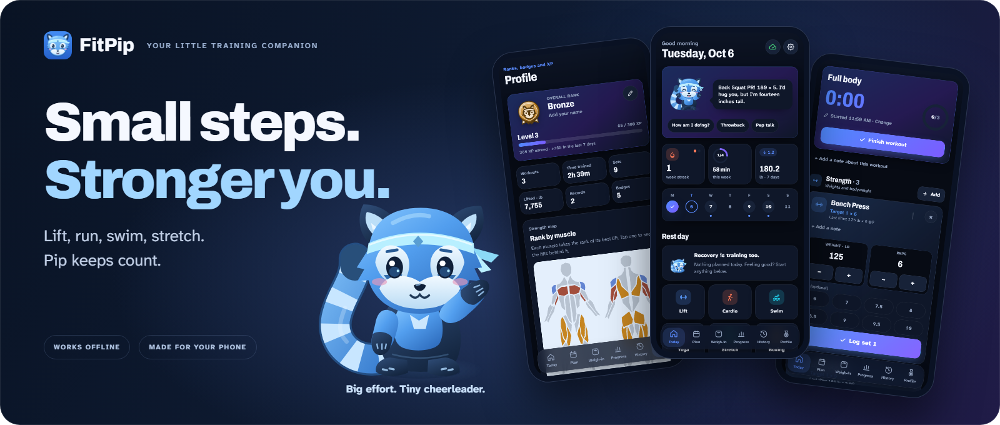
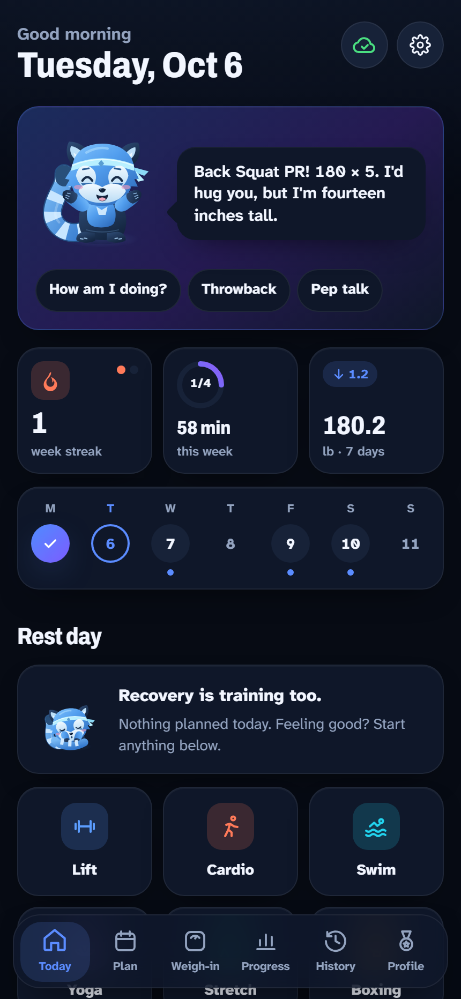
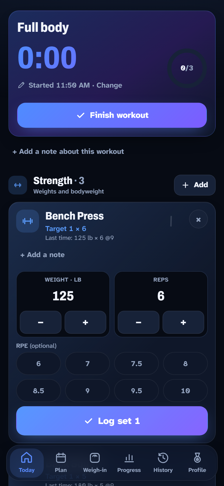
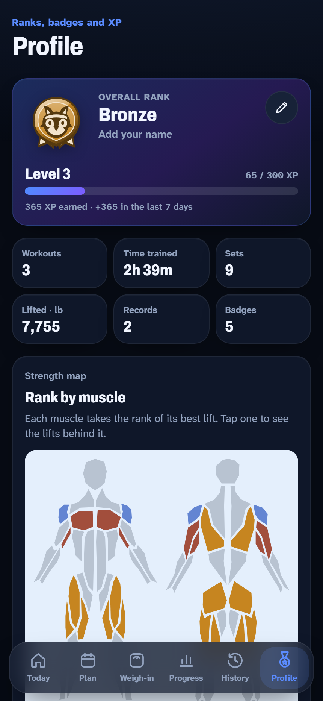
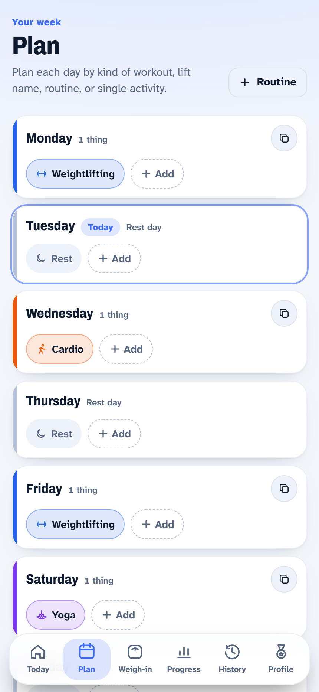
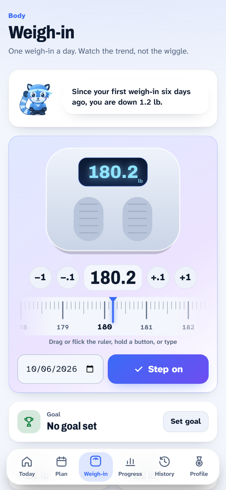
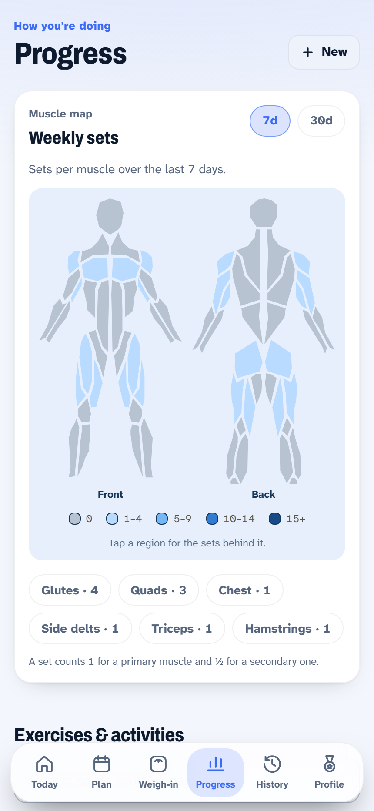
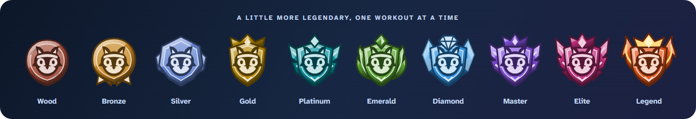

  

<h1 align="center">FitPip</h1>

  <strong>Your workout log, progress tracker, and very small cheerleader.</strong> 
  Lift, run, swim, stretch. Pip keeps count.

  Works offline · Syncs across devices · Light &amp; dark themes

  <a href="https://fit-pip.vercel.app"><strong>Try FitPip</strong></a> ·
  <a href="#meet-pip">Meet Pip</a> ·
  <a href="#a-look-around">Screenshots</a>

---

FitPip is a personal fitness app that brings your training into one place: the sets you lifted, the miles you covered, the week you planned, and the progress you made along the way.

It combines practical workout tools with a little game-like motivation. Log a session, notice a new personal record, earn XP, and watch your Pip badges grow from Wood to Legend. Whether today's plan is a heavy lift or a gentle stretch, it belongs here.

## Try FitPip

  

Open **[fit-pip.vercel.app](https://fit-pip.vercel.app)** in your browser and check it out. Select **Continue as guest** to explore sample workouts, the weekly plan, weigh-ins, and Pip, or sign in to sync your training across devices.

Guest data stays in this browser on this device. Export anything you want to keep from **Settings → Your data**.

An App Store release is planned. For now, you can use the web app at the link above.

## Meet Pip

  
  
  

Pip is your blue panda training companion. He celebrates your records, remembers how your lifts have changed, offers a pep talk when you need one, and makes room for rest days too.

Tap him for another thought, ask **How am I doing?**, revisit a **Throwback**, or choose a **Pep talk**. His expressions and poses match what he says. Finish a workout and he has a little celebration waiting for you.

*Big effort. Tiny cheerleader.*

## A look around

Real app screens, captured with FitPip's built-in guest data. The first row shows the dark theme; the second shows the light theme. Select an image to see it at full size.

<table>
  <tr>
    <th width="33%">Today</th>
    <th width="33%">Workout</th>
    <th width="33%">Profile</th>
  </tr>
  <tr>
    <td align="center"></td>
    <td align="center"></td>
    <td align="center"></td>
  </tr>
  <tr>
    <td align="center">Your day, with a little encouragement.</td>
    <td align="center">Everything you need between sets.</td>
    <td align="center">Progress you can see and celebrate.</td>
  </tr>
  <tr>
    <th>Plan</th>
    <th>Weigh-in</th>
    <th>Progress</th>
  </tr>
  <tr>
    <td align="center"></td>
    <td align="center"></td>
    <td align="center"></td>
  </tr>
  <tr>
    <td align="center">A week that fits your routine.</td>
    <td align="center">Watch the trend, not the wiggle.</td>
    <td align="center">See where your effort is going.</td>
  </tr>
</table>

## Built for the way you train

  

| Bring your… | FitPip keeps track of… |
| --- | --- |
| **Strength sessions** | Weight, reps, optional RPE, personal records, notes, and a configurable rest timer. |
| **Runs, rides, and swims** | Time, distance, and pace, with a stopwatch when you need one. |
| **Yoga, stretching, boxing, and sports** | Timed holds, rounds, and practice alongside your lifts and cardio. |
| **Weekly routine** | Workout categories, saved routines, and individual activities, with multiple items per day. |
| **Bodyweight goals** | Daily weigh-ins, a goal line, trend charts, and recent changes. |
| **Training history** | Past sessions you can edit, favorite, and repeat, plus exercise progress and muscle maps. |

Set up your exercises before the workout clock starts. When you're ready, tap **Begin workout** and log as you go. Your previous sets help you pick up where you left off.

### A little more legendary

  

Earn XP for sets, time spent training, finished workouts, new activities, and personal records. Strength badges reflect your best lifts against the selected bodyweight-based standards; cardio badges use pace where supported, and practice badges grow with time invested.

A starting assessment helps you find your first rank. You can skip unfamiliar exercises, do it later, or retake it from Settings. Your logged training continues to shape your progress.

## No signal? Keep going.

  

Once the app has loaded and an account's first sync is complete, FitPip keeps a local copy of your training on your device. Log sets, finish workouts, browse history, adjust your plan, and record weigh-ins without a connection. Changes sync to your account when you're online again and the app is open.

The Today screen and Settings show your sync status. If the same record changes on two devices while offline, the later edit wins. Account sign-in, online exercise searches, loading starter exercises, and optional workout suggestions need a connection.

Your records are yours to take with you: **Settings → Your data** exports workouts and weigh-ins as CSV, or a full copy as JSON. Starting-assessment answers are stored on the current device and do not sync.

---

   
  <strong>One set. One step. One small reason to come back.</strong> 
  See you at the next workout. — Pip

