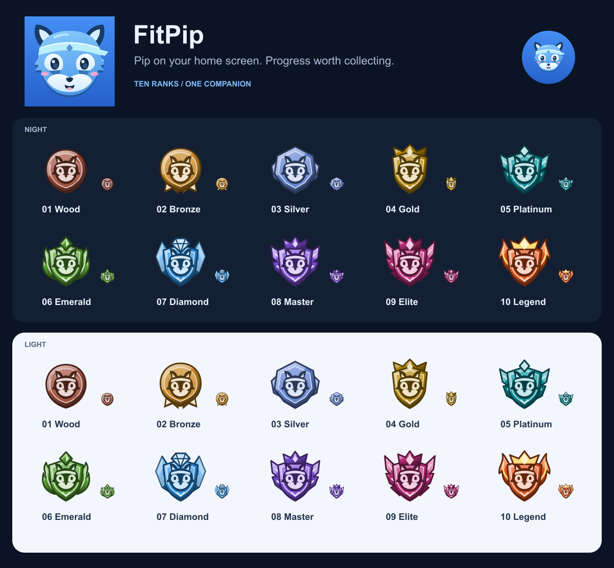

# Pip icons and rank crests

The ten ranks share a Pip enamel crest: pointed ears, a headband, cream eye patches and a
muzzle. Each rank keeps the colour used by the strength map. Shape, material and ornament
also progress so colour is not the only way to distinguish them. There is no tiny lettering
or rank number baked into the art; the interface supplies accessible names and rank numbers.

## Rank artwork

| File | Rank | Colour | Distinctive feature |
| --- | --- | --- | --- |
| `rank-01.svg` | Wood | `#A24E3C` | Carved wooden medallion |
| `rank-02.svg` | Bronze | `#C68520` | Metal medal with ribbon tails |
| `rank-03.svg` | Silver | `#6385D2` | Faceted hexagonal plate |
| `rank-04.svg` | Gold | `#B88A08` | Crowned shield |
| `rank-05.svg` | Platinum | `#0A93A0` | Winged shield and diamond crest |
| `rank-06.svg` | Emerald | `#5AA532` | Leaf surround and emerald crest |
| `rank-07.svg` | Diamond | `#2F95E8` | Cut gem and crystal wings |
| `rank-08.svg` | Master | `#8452E0` | Three-point crown and feathered wings |
| `rank-09.svg` | Elite | `#C2307E` | Tall, layered wings and jewel crown |
| `rank-10.svg` | Legend | `#E4561A` | Flame wings and a warm gold crown |
| `rank-locked.svg` | Not earned | Neutral slate | Lock on the same shield |

Assets live in `public/badges/`. Each has a transparent 128-unit square viewBox, scales to any
resolution, and is under 5 KB. They are checked at 32px (rank ladders), 36px (body-part ranks),
and larger badge sizes on both themes. The app uses the same assets in Profile, lift and
activity sheets, body-part ranks and workout rewards. The service worker precaches them.

Edit `scripts/art/rank-emblems.mjs`, then run `npm run badges` (Node 22.18+ for native TypeScript
imports). Rank names and colours are read directly from `src/config/ranks.ts`; do not maintain
a second rank palette. `src/config/badgeArt.ts` maps the files and still supports optional
`lift:`, `activity:`, `muscle:` and `overall` overrides.

## App icon

The close-up portrait follows the current Pip rig in `src/components/pip/`: blue coat,
dark ears, cream markings, cheek tufts, blush and a pale headband with a diamond. Large eyes,
a smile and a full-bleed blue background give it a friendly home-screen presence. This is
original Pip artwork with the bold, simple character framing requested for the app icon.

Edit `scripts/art/pip-icon.mjs`, then run `npm run icons`. It writes:

- `public/favicon.svg` — scalable browser icon.
- `public/icons/icon-192.png` and `icon-512.png` — standard PWA icons.
- `public/icons/icon-maskable-512.png` — smaller portrait inside Android's circular safe area.
- `public/apple-touch-icon.png` — 180px iOS home-screen icon.

The icon canvas is opaque and square; the operating system supplies corner or circle masks.
The existing manifest and HTML references consume these paths without additional changes.
Existing installed home-screen icons may require removing and re-adding the shortcut to refresh.

## Review and reproduce

Run `node scripts/preview-art.mjs` after regenerating assets to refresh `docs/art-preview.png`.
The board uses the actual shipped assets at 110px and 32px, plus a circular maskable icon.
The preview stays in docs and is not added to the app's offline cache.

All art is editable SVG source built with the repository's existing Sharp dependency;
no image-generation API or external runtime assets are required.
