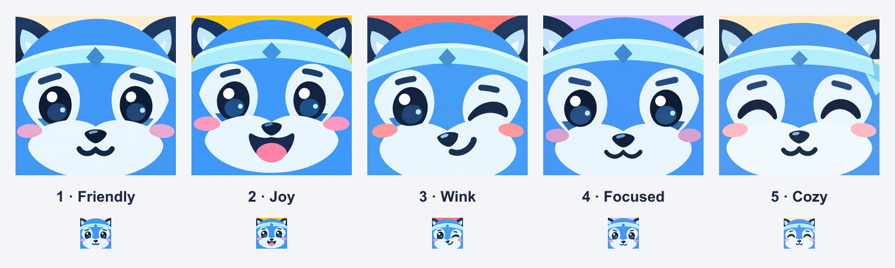

# Pip face close-ups

Five close-up icon concepts for FitPip, with bold, expressive faces. Pip's blue fur, pale face markings and diamond headband identify the character.

| Version | Expression | Original PNG |
| --- | --- | --- |
| 1 | Friendly | [pip-01-friendly.png](pip-01-friendly.png) |
| 2 | Joy | [pip-02-joy.png](pip-02-joy.png) |
| 3 | Wink | [pip-03-wink.png](pip-03-wink.png) |
| 4 | Focused | [pip-04-focused.png](pip-04-focused.png) |
| 5 | Cozy | [pip-05-cozy.png](pip-05-cozy.png) |

**Version 4 (Focused) is selected for FitPip.** The production version has a dark navy background and lives in [pip-focused-dark.png](../../../scripts/art/pip-focused-dark.png). Run `npm run icons` to regenerate the iPhone, Android, browser and main README assets from that source.

The icons are opaque square images; the operating system supplies the installed icon's corner mask.

The original character reference is saved as [reference-pip.png](reference-pip.png). The comparison includes each image at a large preview size and at 48px.
